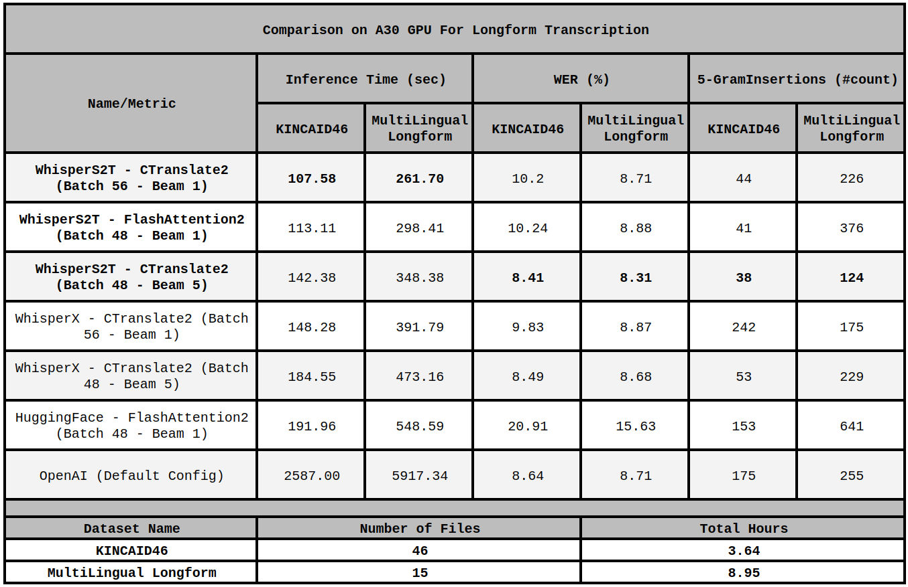

# WhisperS2T ⚡

WhisperS2T is an optimized lightning-fast speech-to-text pipeline tailored for the whisper model! It's designed to be exceptionally fast, boasting a 1.5X speed improvement over WhisperX and a 2X speed boost compared to HuggingFace Pipeline with FlashAttention 2 (Insanely Fast Whisper). Moreover, it includes several heuristics to enhance transcription accuracy.

[**Whisper**](https://github.com/openai/whisper) is a general-purpose speech recognition model developed by OpenAI. It is trained on a large dataset of diverse audio and is also a multitasking model that can perform multilingual speech recognition, speech translation, and language identification.

## Benchmark and Technical Report

Stay tuned for a technical report comparing WhisperS2T against other whisper pipelines. Meanwhile, check some quick benchmarks on A30 GPU.




## Features

- 🔄 **Multi-Backend Support:** Support for various Whisper model backends including Original OpenAI Model, HuggingFace Model with FlashAttention2, and CTranslate2 Model.
- 🎙️ **Easy Integration of Custom VAD Models:** Seamlessly add custom Voice Activity Detection (VAD) models to enhance control and accuracy in speech recognition.
- 🎧 **Effortless Handling of Small or Large Audio Files:** Intelligently batch smaller speech segments from various files, ensuring optimal performance.
- ⏳ **Streamlined Processing for Large Audio Files:** Asynchronously loads large audio files in the background while transcribing segmented batches, notably reducing loading times.
- 🌐 **Batching Support with Multiple Language/Task Decoding:** Decode multiple languages or perform both transcription and translation in a single batch for improved versatility and transcription time.
- 🧠 **Reduction in Hallucination:** Optimized parameters and heuristics to decrease repeated text output or hallucinations.
- ⏱️ **Dynamic Time Length Support (Experimental):** Process variable-length inputs in a given input batch instead of fixed 30 seconds, providing flexibility and saving computation time during transcription.


## Getting Started

### Installation

```sh
# Install audio utils
apt-get install -y libsndfile1 ffmpeg

# Install WhisperS2T
pip install -U git+https://github.com/shashikg/WhisperS2T.git
```

### Usage

```py
import whisper_s2t

model = whisper_s2t.load_model(model_identifier="large-v2", backend='CTranslate2')

files = ['data/KINCAID46/audio/1.wav']
lang_codes = ['en']
tasks = ['transcribe']
initial_prompts = [None]

out = model.transcribe_with_vad(files,
                                lang_codes=lang_codes,
                                tasks=tasks,
                                initial_prompts=initial_prompts,
                                batch_size=32)

print(out[0][0])
"""
[Console Output]

{'text': "Let's bring in Phil Mackie who is there at the palace. We're looking at Teresa and Philip May. Philip, can you see how he's being transferred from the helicopters? It looks like, as you said, the beast. It's got its headlights on because the sun is beginning to set now, certainly sinking behind some clouds. It's about a quarter of a mile away down the Grand Drive",
 'avg_logprob': -0.25426941679184695,
 'no_speech_prob': 8.147954940795898e-05,
 'start_time': 0.0,
 'end_time': 24.8}
"""
```


## License

This project is licensed under MIT License - see the [LICENSE](LICENSE) file for details.

